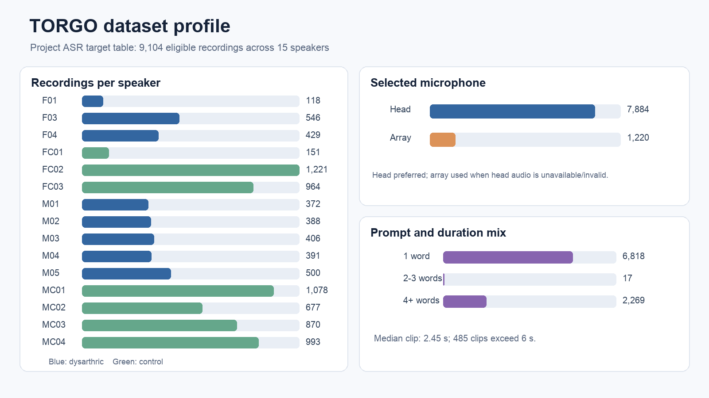
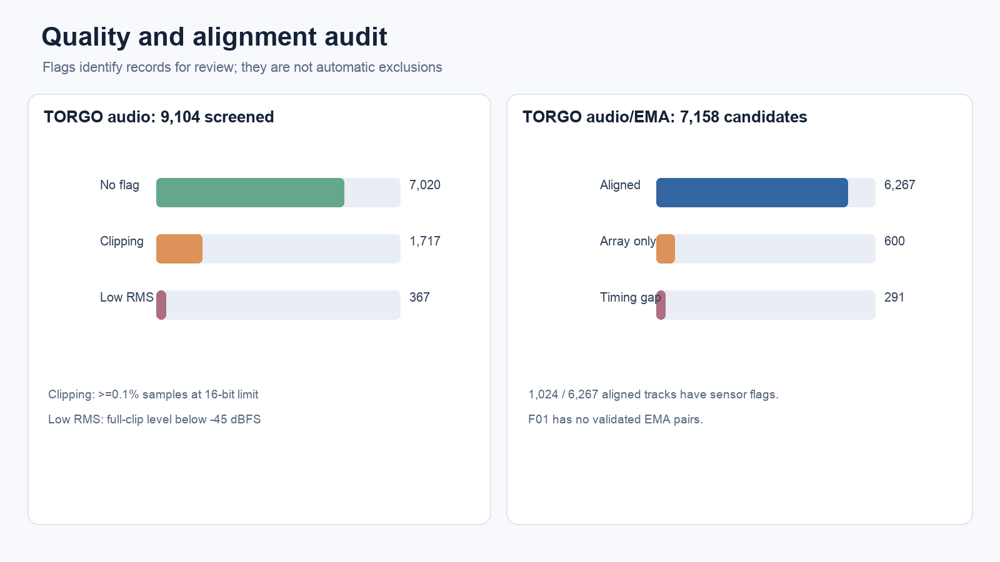
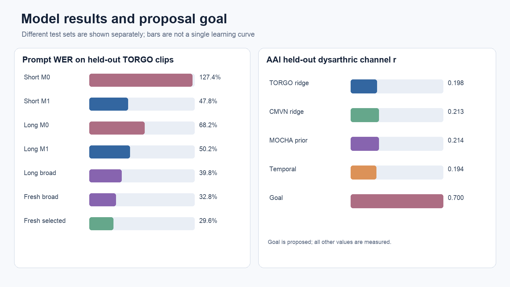

# NeuroSAFE-Voice: Detailed Phase 1 Project Report

**A risk-calibrated, motor-phenotype adaptive voice assistant for individuals with dysarthria**

**Project status:** research prototype and local assistant simulator

**Evidence cutoff:** 8 October 2026

**Source of proposed requirements:** project approval presentation supplied with this workspace

**Evidence used for measured results:** saved project manifests, metrics, model configurations, experiment reports, and one local recorder evaluation

## Executive summary

NeuroSAFE-Voice aims to turn dysarthric speech into reliable, understandable, and safely confirmed digital actions. The proposal combines a dysarthria-adapted automatic speech recognizer (ASR), inferred articulatory features, personal context, structured intent extraction, and action safeguards. Phase 1 has implemented the data preparation and evaluation infrastructure, several acoustic-to-articulatory inversion (AAI) and ASR experiments, a local command recorder, and a simulated intent/action flow. It has **not** completed the proposed end-user voice assistant or met its numerical acceptance targets.

The working datasets are TORGO and MOCHA-TIMIT. TORGO provides the dysarthric ASR evaluation and the dysarthric/control audio plus electromagnetic articulography (EMA) pairs for AAI. MOCHA-TIMIT supplies typical-speech audio/EMA pairs for an AAI reference and transfer experiments. UA-Speech was proposed for a later phase and was not used in the reported training or evaluation.

The best measured ASR result on a newly frozen 40-clip multiword test is **29.6% prompt-reference WER** for a validation-selected Whisper Small LoRA adapter, versus 32.8% for the preceding adapter. The 95% paired bootstrap interval for the difference includes zero; this small sample does not establish a general improvement. On the previously examined 187-clip longer test, a broader-prompt LoRA adapter achieved **39.8% prompt-reference WER**. Most of its gain over the earlier 50.2% adapter came from correcting one repeated-output failure. The retained TORGO AAI model achieved **0.213 mean channel Pearson r** across seven held-out dysarthric speakers, below the proposed 0.70. Inferred-AAI fusion did not improve the short-clip ASR pilot. Synthetic text and voice checks passed the local simulator, but real dysarthric command accuracy, entity resolution, task success, false-action rate, confidence calibration, and full end-to-end latency remain unestablished.

**Reference policy:** the user designated TORGO written prompts as project targets. No checked TORGO clips were linked to individual recording IDs, so no prompt was promoted to a clip-specific human-verified transcript. WER throughout this report is **prompt-reference WER** unless another reference type is explicitly named. A prompt may differ from the words a speaker actually said.

## 1. Problem, objectives, and scope

Dysarthria changes articulation, voicing, speaking rate, and pause patterns. A general-purpose ASR error can prevent a user from controlling a device; an incorrectly interpreted command can also produce an unwanted action. The proposal therefore asks four linked questions:

1. Does combining acoustics with inferred articulation improve recognition for severe or unseen speakers?
2. Can a small LoRA adapter improve recognition with limited target-domain training?
3. Can private context resolve personal names and short commands accurately?
4. Can recognition uncertainty and action risk prevent wrong actions while preserving usability?

The present work directly tests the first two questions through AAI and ASR ablations. It implements a narrow, deterministic local intent simulator relevant to the fourth question. It has not implemented a private retrieval-augmented generation (RAG) store, a local LLM normalizer, calibrated ASR confidence, a production tool connector, or human-subject task-success evaluation. These proposed modules are described as **future system requirements**, not as completed results.

The proposal's quantitative acceptance criteria are: ASR WER at most 20-25%, mean AAI Pearson r at least 0.70, entity resolution at least 90%, at least 92% correct zero-click tool execution, and end-to-end latency at most 1.5 seconds. A target is an evaluation criterion, not an observed measurement.

## 2. System design and data flow

The experimental pipeline is:

```text
TORGO / MOCHA source files
    -> inventory, prompt screening, microphone selection, quality audits
    -> fixed speaker and utterance splits
    -> 16 kHz audio and aligned 100 Hz log-mel / EMA features
    -> AAI models (audio -> inferred tongue/lip/jaw trajectories)
    -> Whisper Small baseline and LoRA ASR (audio -> text)
    -> optional inferred-AAI fusion ablation (audio + predicted EMA -> text)
    -> local intent parser, risk gate, confirmation UI, simulated receipt
```

The ASR backbone consumes speech audio and outputs a word sequence. The AAI branch consumes speech-derived acoustic features and outputs estimated articulator trajectories; its output is an **inference from audio**, not a sensor measurement at deployment. The fusion ablation supplies those estimates to the ASR encoder. The assistant simulator maps recognized text to a limited intent and arguments, requires confirmation under its current policy, and emits a simulated receipt. It has no installed connector to place calls, send messages, delete files, or control devices.

The repository keeps scripts in `scripts/`, human-readable reports and review interfaces in `reports/`, project CSVs in `data/exports/`, prepared indexes in `data/processed/`, metrics and model artifacts in `data/results/`, and presentation files in `output/`. Licensed source audio/EMA, generated feature arrays, review ZIPs containing audio, and participant recordings remain local. See the repository `README.md` and `data/README.md` for reproduction and source terms.

## 3. Datasets, access, and experimental roles

| Dataset | Local inventory | Material used in Phase 1 | Role | Important boundary |
| --- | ---: | --- | --- | --- |
| TORGO | 9,889 speaker/session/utterance IDs, 15 speakers | 9,104 ASR target recordings; 6,267 format/timing-verified head-audio/EMA pairs | Dysarthric ASR, AAI adaptation, held-out tests | Written prompts are project targets, not independent verbatim transcripts. |
| MOCHA-TIMIT | 1,380 IDs across `fsew0`, `msak0`, and supplementary `maps0` | 919 decoded pairs from the two primary speakers | Typical-speech AAI baseline and exploratory prior/pretraining | `maps0` is supplementary and absent from the primary AAI experiment. |
| UA-Speech | No project training/evaluation records | None | Proposed Phase 2 personalization benchmark | Approval/access and data preparation are outside this Phase 1 result. |
| Local commands | One saved local demonstration clip plus 18 synthetic-voice items | Recorder workflow and simulated decision checks | Integration smoke tests | One human-produced clip cannot estimate dysarthric-user accuracy. |

TORGO is an academic, non-profit-use corpus. MOCHA-TIMIT has a non-commercial research/educational-use license. The public repository intentionally excludes the source recordings and EMA. Anyone reproducing audio-dependent steps must obtain and use each corpus under its original terms. The local command recorder also keeps participant audio outside the public repository.

### 3.1 TORGO microphone policy

The downloaded TORGO release and project manifest expose two audio paths for a trial: `wav_headMic` and `wav_arrayMic`. The publisher describes a head-mounted microphone and an array microphone. This project selects valid 16 kHz **head-microphone audio first** for a consistent close-talk signal and because the AAI alignment check uses the head recording. It falls back to valid array audio when head audio is absent or invalid. The 9,104 ASR targets use 7,884 head recordings (86.6%) and 1,220 array recordings (13.4%). The project does not train on simultaneous multi-microphone channels, and the inspected corpus interface does not provide a third independent microphone path for this pipeline. Array-only audio/EMA candidates require a separate alignment method and are not silently treated as verified head-audio pairs.

## 4. Exploratory data analysis (EDA)

The EDA below was recalculated from `data/processed/utterance_manifest.csv`, `data/exports/torgo_asr_targets.csv`, `data/processed/torgo_aai_validation.csv`, `data/processed/mocha_aai_pairs.csv`, and the saved audit summaries. Counts are for this prepared local copy and screening policy, not necessarily every item the corpus publishers ever distributed. Durations describe the selected project audio. Prompt-length counts below use whitespace-separated target words; WER uses a separate normalized tokenizer, so its reference-word total differs slightly.



### 4.1 TORGO inventory, speaker balance, and duration

The TORGO inventory has 9,889 IDs: 3,615 in eight dysarthric speaker folders and 6,274 in seven control speaker folders. Screening retains 9,104 ASR-eligible recordings (92.1% of inventoried IDs): 3,150 dysarthric and 5,954 control. Per-speaker ASR counts range from 118 for F01 to 1,221 for FC02, so a clip-weighted average is dominated by speakers with more recordings. The fixed four-fold split therefore holds out whole speakers and reports per-speaker results alongside pooled WER.

| TORGO ASR subset | Clips | Selected audio hours | Median duration | 95th-percentile duration | Maximum |
| --- | ---: | ---: | ---: | ---: | ---: |
| All eligible | 9,104 | 7.47 | 2.45 s | 6.20 s | 193.83 s |
| Dysarthric | 3,150 | 3.12 | 2.60 s | 9.46 s | 193.83 s |
| Control | 5,954 | 4.36 | 2.30 s | 4.87 s | 8.50 s |

Most selected clips are short: 8,619 are at most six seconds, 483 are over six and at most 30 seconds, and two exceed 30 seconds. The 193.83-second maximum is an outlier in the inventory and was not used in the at-most-30-second ASR tests. Longer dysarthric recordings are relatively scarce, which limits a fresh balanced long-clip evaluation.

The target-text mix is also uneven: 6,818 clips have one whitespace-separated word, 17 have two or three, and 2,269 have four or more. The median target is one word. This matters because a long hallucinated output against a one-word prompt can make WER exceed 100%. It also means an overall WER can mask a different performance pattern on continuous speech.

### 4.2 Audio and EMA quality



All 9,104 ASR target waveforms were screened. There are 2,084 clips with at least one review flag (22.9%): 1,717 have at least 0.1% of samples at the 16-bit limit and 367 have full-recording RMS below -45 dBFS. These two flags did not overlap in this run. They are **triage flags**; a low full-recording level or clipped samples do not alone establish that a spoken target is unusable. The pilot ASR test selections avoided flagged audio; the main target CSV retains the flags and the project does not automatically discard every flagged recording from all purposes.

For AAI, 7,158 TORGO filename-matched audio/position candidates were checked. Of these, 6,267 (87.6%) have a valid head recording and an AG500 position duration within 20 ms; 600 have array audio only and need an alignment method; 291 have head-audio timing mismatch. The verified subset includes 2,095 dysarthric and 4,172 control pairs. Seven dysarthric and seven control speakers have validated pairs; F01 has none. A total of 1,024 of the 6,267 validated tracks have a sensor review flag. The screen found 1,014 tracks with a large position step, 13 with a normally active flat channel, and 10 usually unavailable speaker/session channels. Sensor flags can overlap and are not proof of a physical artifact. Publisher error notes were joined conservatively; ambiguous trial matches were not assigned to a specific track.

The TORGO preprocessing preserves channel-level masks. A faulty tongue channel does not force removal of usable lip or jaw targets. The released `.pos` tracks are treated as head corrected according to the publisher documentation. Training-set normalization and any learned masks are fitted inside the relevant training fold to avoid speaker leakage.

### 4.3 MOCHA-TIMIT coverage and timing

The two primary MOCHA speakers contribute 460 `fsew0` pairs and 459 `msak0` pairs; one `msak0` recording marked corrupt by the publisher is excluded. Each speaker has 30 validation and 30 test utterances; the remaining 400 and 399 are training utterances. The supplementary `maps0` archive is inventoried but not used as a primary AAI speaker because it lacks the same per-utterance phoneme-label coverage and has publisher-noted issues.

Across 919 decoded pairs, median audio duration is 3.97 seconds and median EMA duration is 3.55 seconds. The audio exceeds the EMA track by a median 0.384 seconds; 60 pairs have a gap over 0.5 seconds. Feature extraction uses only the overlapping time span and preserves supplied timestamps rather than forcing a guessed lag. The primary decoded pairs have fully present tracked EMA frames under this parser, but that check does not establish that every coordinate is an equally reliable training target.

### 4.4 Prompt validity and annotation status

The initial TORGO inventory flags include 395 IDs without a prompt, 387 with an unusable prompt, and 23 without valid selected audio; categories can overlap. The ASR target exporter retains 9,104 rows after screening. It preserves `written_prompt` and writes the project's normalized `target_text`; 85 targets remove bracketed pronunciation guidance. The user accepted written prompts as working targets. No reviewed TORGO recording IDs and corrected spoken-word transcripts were supplied, so `manual_verified_transcripts.csv` has no adjudicated rows. The 180-item listening queue and 187-item long-test review page are review tools, not verified ground truth by themselves.

## 5. Preprocessing and reproducible split design

1. **Inventory and select audio.** The preparation script enumerates speaker/session/utterance IDs, records modality paths, reads duration and sample rate, checks prompts, and selects head then array audio. The project uses 16 kHz audio for the selected path. It records exclusions and quality flags rather than silently dropping rows.
2. **Freeze splits.** TORGO uses four speaker-disjoint folds. Each of the eight dysarthric speakers is a test speaker once; validation speakers are also excluded from that fold's training. MOCHA uses a fixed within-speaker 400/30/30 or 399/30/30 split plus an unseen-speaker swap check.
3. **Prepare AAI pairs.** TORGO `.pos` frames are parsed, their duration is compared with head audio, and suspect channels are masked. MOCHA EMA is decoded with its supplied timestamps. Both feature pipelines produce 40-band log-mel acoustic frames at 100 Hz from 25 ms windows and 10 ms hops, with target arrays on the overlapping time axis.
4. **Normalize within training boundaries.** Feature/target model statistics are fitted on training speakers or training utterances as appropriate. The improved TORGO ridge also normalizes each recording's own acoustic features without using that recording's EMA. Validation chooses hyperparameters/checkpoints; test speakers remain held out.
5. **Export inference-only articulation for ASR.** AAI sequences used on held-out ASR speakers are predicted from audio by models that did not train on that speaker. The training-side features in the original short fusion pilot were less strictly out of fold; this is listed as a limitation rather than a fully leakage-free multimodal comparison.

## 6. Models: input, output, training, and purpose

| Component | Training input and target | Inference input | Output | Actual implementation status |
| --- | --- | --- | --- | --- |
| MOCHA ridge AAI | 40-band log-mel context to 14 EMA coordinates (seven articulators, two axes), with train-only normalization | Typical-speech audio features | 14 continuous coordinate traces | Trained separately for the two primary speakers; within-speaker and speaker-swap tests saved. |
| TORGO ridge AAI | 70 ms log-mel context to 12 masked, utterance-centered sagittal coordinates from six articulators | Audio features only | 12 inferred tongue/lip/jaw coordinate traces | Four speaker-held-out folds; per-recording acoustic normalization selected. |
| MOCHA-prior TORGO ridge | Same TORGO pairs, with coefficient shrinkage toward a MOCHA model | Audio features only | 12 inferred TORGO-aligned traces | Tested; negligible dysarthric gain. |
| Temporal AAI | 40-band log-mel windows to 12 masked coordinate traces; smooth-L1 loss | Audio features only | 12 inferred coordinate traces | Four dilated-convolution blocks, 96 hidden channels; scratch, MOCHA-pretrained, and dysarthric-only variants tested. |
| Whisper Small baseline (M0) | No TORGO adaptation | Selected 16 kHz audio | Transcript text | Full-corpus MLX zero-shot baseline and a separate paired Hugging Face baseline on fixed pilot/long clips. |
| Whisper Small LoRA (M1) | TORGO audio and user-designated prompt targets; rank-8 adapters on a frozen pretrained backbone | Audio | Transcript text | Four fold-specific adapters in short, long, broader-prompt, and targeted-multiword rounds. The short pilot trained 884,736 parameters, about 0.37% of the adapted model. |
| Additive AAI fusion (M2) | Frozen M1 states plus inferred AAI; prompt targets | Audio and AAI predicted from that audio | Transcript text | Short pilot trained and evaluated; no WER benefit over M1. |
| Gated cross-attention AAI fusion (M3) | Frozen M1 states plus inferred AAI; prompt targets | Audio and AAI predicted from that audio | Transcript text | Short pilot trained and evaluated; no WER benefit over M1. |
| Assistant intent/safety core | Handwritten allowlisted rules and fictional local fixtures, not a learned command model | Transcript and optional confidence value | Structured intent, arguments, risk/status, simulated receipt | Implemented as a local simulator. ASR confidence is not calibrated; real external actions are disabled. |

The full-corpus MLX Whisper baseline and the Hugging Face Whisper Small baselines are separate runs with different clip sets/decoding and must not be treated as a controlled before/after comparison. The directly paired M0/M1 comparisons below use the same clips and decoding within each experiment. The project has **not** trained a production speaker-specific adapter from each new participant's own commands; the reported LoRA models instead train on other TORGO speakers and test unseen speakers.

## 7. Evaluation definitions and safeguards

**WER** is `(substitutions + deletions + insertions) / reference words`. The scoring text is lowercased and normalized to alphanumeric word tokens with apostrophes removed. WER may exceed 100% when insertions outnumber reference words. Because TORGO references here are elicitation prompts, the measured value is prompt-reference WER, not independently adjudicated verbatim WER. Scores from different clip selections must be compared only within a paired experiment.

**AAI Pearson r** is calculated for each valid position channel on held-out speech frames, then summarized over channels and speakers. A high r indicates trajectory association; it is not a proof of physically accurate 3D tracking, and differing sensor geometry makes MOCHA-to-TORGO transfer approximate. The reported dysarthric TORGO AAI macro mean excludes F01 because no validated EMA pair is available.

**Intervals** in the saved ASR reports are descriptive paired bootstrap intervals that resample the eight fixed test speakers and clips within speakers. Their interpretation is limited by the small speaker set, repeated prompt texts, selected test samples, and reuse of the longer set in multiple development rounds. The AAI improvement interval likewise describes seven fixed dysarthric test speakers. A test-selection or decoder idea motivated by a test error is identified as exploratory.

**Leakage control:** whole TORGO speakers are excluded from their fold's training and validation/test roles; checkpoint selection uses validation speakers. MOCHA within-speaker and swap evaluations answer different questions. Prompts recur across speakers, so a speaker-held-out TORGO result tests unseen speakers rather than entirely unseen wording.

## 8. Experimental results



### 8.1 Full TORGO zero-shot ASR baseline

The local MLX Whisper Small English model transcribed all 9,104 ASR-eligible TORGO recordings without TORGO adaptation. Dysarthric speech had **71.3% prompt-reference WER** over 3,150 clips and 7,861 normalized reference words; controls had **11.9%** over 5,954 clips and 15,123 words. The overall pooled 32.2% is heavily affected by the larger control subset and is not a suitable dysarthric performance headline. Among dysarthric speakers, WER ranged from 8.0% for M03 to 169.8% for M04, demonstrating major speaker heterogeneity. Prompt length also matters: full-corpus 1-3-word references had 64.6% WER, versus 18.4% for references of four or more words. These groups differ in content and speaker distribution, so this is descriptive EDA rather than a causal length effect.

### 8.2 MOCHA AAI and cross-corpus transfer

The simple MOCHA ridge AAI model achieved mean channel r of **0.581** for `fsew0` and **0.598** for `msak0` on each speaker's 30 held-out test utterances. Training on one speaker and evaluating the other reduced r to **0.317** and **0.313**. This transfer gap is relevant because different sensor placements and coordinate conventions may limit use of a healthy-speaker prior for TORGO. The TORGO-only ridge gave dysarthric speaker-mean r **0.198** and control r **0.321**. Adding the MOCHA coefficient prior changed each mean by about 0.001. Per-recording acoustic normalization improved TORGO-only ridge to **0.213** dysarthric and **0.342** control; six of seven dysarthric test speakers improved, with a descriptive 95% interval of +0.007 to +0.023 for the dysarthric mean change. The normalized MOCHA-prior variant was 0.214 dysarthric. Tested temporal models did not exceed the retained normalized ridge on dysarthric speakers (0.194 for TORGO all-speaker temporal training; 0.191 with MOCHA pretraining). The proposed r >= 0.70 remains unmet.

### 8.3 Paired short-clip M0-M3 ablation

The fixed short pilot used 280 unflagged clips of at most six seconds, 35 per dysarthric test speaker, and 423 normalized target words. M1 used a rank-8 LoRA adapter and 120 updates per fold. M2 and M3 used inferred AAI from audio and trained additional fusion layers for 120 updates. All four variants were scored on the same clips.

| Variant on 280 short clips | Word errors | Prompt WER | Interpretation |
| --- | ---: | ---: | --- |
| M0 paired Whisper Small | 539 | 127.4% | Many insertions against short prompts. |
| M1 LoRA | 202 | 47.8% | Large paired improvement on this selected pilot. |
| M2 additive inferred AAI | 203 | 48.0% | One more error than M1. |
| M3 gated inferred AAI | 204 | 48.2% | Two more errors than M1. |

M1 reduced WER by 79.7 percentage points compared with its paired M0, and all eight held-out speakers improved. The descriptive paired 95% interval for the reduction was 35.5-146.9 points. However, 254 of 280 clips have one to three target words, so this pilot mostly probes isolated or very short prompts. Neither fusion method demonstrated an ASR gain.

### 8.4 Longer held-out TORGO recordings

The frozen long set contains 187 different dysarthric-speaker recordings, each over six and at most 30 seconds, from all eight dysarthric speakers. It has 1,567 normalized target words. The paired unadapted Whisper Small baseline made 1,069 errors (**68.2% WER**); an initial 240-step-per-fold LoRA adapter made 786 errors (**50.2%**). A broader-prompt LoRA experiment later sampled 723-780 unique training clips per fold from larger training-speaker pools, ran up to 900 updates per fold, selected checkpoints on validation-speaker loss, and made 624 errors on the same 187 test clips (**39.8%**).

The 50.2% to 39.8% change is fragile. One M04 recording had 157 errors, including 148 insertions, under the earlier adapter and seven errors under the broader model. That single recording accounts for 150 of the 162 errors saved. Excluding it from both models gives **40.5% versus 39.7%** on the other 186 clips, a 0.8-point difference. The 95% paired interval for the full broader-minus-earlier result spans -44.6 to +2.4 WER points, including no improvement. The longer test set was revisited during development, so its result is useful error analysis, not a fresh untouched final benchmark. The project's 20-25% WER target is not met.

### 8.5 Fresh multiword test and targeted continuation

Before targeted multiword continuation, the project froze a separate 40-clip test: five previously unused unflagged recordings with at least four target words from each dysarthric speaker. The test excludes the earlier 187 long clips, short-pilot test clips, and 180-item listening queue. The broader-prompt model made 90 errors in 274 reference words (**32.8% WER**). Additional training sampled 476-513 unique train clips per fold; validation selected continuation steps of 300, 0, 300, and 600. The selected adapters made 81 errors (**29.6% WER**). The paired interval for selected-minus-prior WER is **-10.3 to +1.4 points**, so the sample does not establish an improvement. M04 worsened by one word and three other speakers were unchanged. Only nine of the 40 clips exceed six seconds. This test is fresh and multiword, but it is not a balanced fresh long-recording test and still misses the proposed 20-25% WER target.

### 8.6 Assistant, recorder, and local clip

The deterministic intent/safety core passed **26/26 authored text fixtures** for intended intent and safe routing. Narrative TORGO ASR hypotheses produced zero action-intent matches in the saved 187-clip and 40-clip negative-control scans. A macOS synthetic voice reading 16 supported commands and two non-command controls gave **18/18 intended intents**, two ASR word errors over 80 prompt words, and zero real actions. These are software/synthetic checks; they are not estimates of dysarthric-user intent or entity accuracy.

The local recorder saves one prompt at a time as 16 kHz mono WAV, records pseudonymous speaker/session IDs and prompt metadata, exports a CSV, and can run a saved clip through ASR plus the simulated decision flow. An end-to-end server smoke check with generated silence passed GET, prompt loading, POST, WAV conversion, manifest writing, and analysis response. A subsequent local evaluation contains **one human-produced clip**: four prompt words, four prompt-reference errors, no correct intent, no scored entity, and zero real actions. Its 100% one-clip WER is an individual workflow observation and cannot estimate performance for users with dysarthria or any speaker group. No manually corrected spoken-word transcript is linked to that clip.

On the fresh 40 TORGO clips, loaded-model audio processing had median **0.302 s** and p95 **0.382 s**, measured from WAV read through ASR output. The saved synthetic-command run had warm file-to-simulated-decision median **0.283 s** and p95 **0.359 s**. The one local clip took **0.399 s** from WAV read to simulated decision. All omit some or all of speech capture, startup, UI, and external action execution. They do not validate the proposed <=1.5 s end-to-end target. No real calls, messages, deletions, or device actions were executed.

## 9. Error analysis and interpretation

The most important observed failure mode is insertion or repetition on short prompts. It inflated M0 pilot WER above 100% and created the M04 long-clip outlier in the earlier LoRA run. The broader-prompt model corrected that outlier, but ordinary substitutions on other speakers remain. A decoder guard (`max_new_tokens=64`, `no_repeat_ngram_size=3`) was checked on 233 validation clips after the M04 error was noticed. It made 305 versus 304 errors for default decoding and was **not** selected for the test set. The idea was motivated by a test error, so any future repetition fix should be tested on a genuinely new set.

AAI error sources include unavailable/faulty channels, ambiguous publisher notes, imperfect audio/EMA alignment, cross-corpus articulator mismatch, and sparse dysarthric paired data. AAI trajectories inferred from audio do not add independent sensor information. The current branch is useful as a controlled representation experiment, but its low held-out correlation is a plausible reason it did not help ASR.

The data also mix prompt types, speaker conditions, sessions, and microphone availability. A dysarthric/control WER gap is descriptive and should not be interpreted as a causal estimate of dysarthria severity. The source prompt may differ from actual speech. The brief earlier listening check did not record IDs, so it cannot convert every project prompt into a verified transcript. Future review must attach a decision and corrected text, if any, to the exact speaker/session/utterance clip.

## 10. Requirement traceability and current status

| Proposed requirement | Evidence by cutoff | Status |
| --- | --- | --- |
| Prepare TORGO and MOCHA-TIMIT with quality controls | Inventories, fixed splits, 9,104 TORGO ASR targets, 6,267 verified TORGO AAI pairs, 919 MOCHA pairs, audio/sensor audits | Implemented for Phase 1, with flagged cases still needing manual adjudication. |
| Adapt ASR with LoRA | Four speaker-held-out fold families and saved adapters; 29.6% WER on fresh 40 multiword clips | Implemented experimentally; 20-25% target unmet. |
| Recover articulation from audio | MOCHA and TORGO ridge/temporal models; retained dysarthric mean r 0.213 | Implemented experimentally; 0.70 target unmet. |
| Demonstrate useful acoustic/articulatory fusion | M2 48.0% and M3 48.2% versus M1 47.8% on the same short pilot | Tested; no gain demonstrated. |
| Personalize a new user's ASR with limited own data | TORGO unseen-speaker adaptation experiments; one local clip | Not yet measured as user-specific personalization. |
| Private RAG/personal lexicon and local LLM intent normalizer | Small fictional alias table and deterministic parser only | Proposed, not implemented as RAG/LLM. |
| Calibrated confidence and risk-tiered real actions | Confirmation gate and simulated receipts; no calibrated ASR confidence or external tools | Safety simulator implemented; real execution and calibration unmeasured. |
| Entity >=90%; correct zero-click actions >=92% | 26 text fixtures and 18 synthetic-voice items only | Human-user targets unmeasured. |
| End-to-end latency <=1.5 s | Warm partial pipeline timings only | Unmeasured end to end. |

## 11. Recommended next experimental steps

1. **Create a clip-linked reference set.** Use the existing review UI to record exact IDs, reviewer, `prompt_matches` or corrected spoken text, and audio issues. Keep prompt-reference and verbatim-reference WER separate. Review a random sample as well as error-rich clips, reporting the sampling method and counts.
2. **Collect a fresh command evaluation set.** With the institution's approved participant process, record more than one session and more than one speaker, including dysarthric commands and negative controls. Freeze an untouched test set before choosing prompts, thresholds, adapters, or decoding rules from it. Keep participant audio local and access controlled.
3. **Improve ASR on the residual error pattern.** Analyze clip-linked substitutions for F01, M01, M02, M04, and M05, and separately analyze insertion/repetition failures. Select the next training or decoding change using train/validation speakers, then evaluate once on a fresh held-out set. Report per-speaker WER, pooled WER, confidence intervals, and a sensitivity analysis excluding outliers.
4. **Strengthen AAI before another fusion claim.** Adjudicate high-priority sensor traces, improve alignment and channel masks, and compare new AAI models on the same seven held-out dysarthric speakers. Only repeat M2/M3 fusion if inferred AAI improves over the stronger audio-only M1 on identical clips without unacceptable latency.
5. **Implement and measure the proposed assistant modules.** Add a local personal lexicon/retrieval store, calibrated ASR/intent uncertainty, schema-validated tool adapters, explicit high-risk confirmation, receipts, cancellation, and audit logs. Evaluate entity accuracy, false actions, real task success, and full latency with consenting users. A 26/26 authored-fixture result must not be reported as human task success.
6. **Keep Phase 2 separate.** If UA-Speech access is approved, inventory it under its own terms and create a predeclared evaluation protocol. Do not combine its results with TORGO without stating corpus, speaker, prompt, and scoring differences.

## 12. Reproduction and artifact map

Start from a Python 3.12 environment using `requirements-experiments.lock`. Obtain TORGO and MOCHA-TIMIT from their original hosts and place their permitted local copies under `data/raw/` and `data/extracted/`. The project scripts use repository-relative paths. Main entry points include `scripts/prepare_datasets.py` for inventory/splits, `scripts/audit_torgo_audio.py` and `scripts/audit_torgo_sensors.py` for quality, `scripts/prepare_mocha_aai.py` and `scripts/prepare_torgo_aai_features.py` for AAI preparation, `scripts/compare_aai_transfer.py` for ridge AAI, `scripts/train_temporal_aai.py` for temporal alternatives, `scripts/whisper_lora_pilot.py` and `scripts/whisper_full_prompt_training.py` for ASR adaptation, `scripts/fusion_pilot.py` for M2/M3, and `scripts/evaluate_fresh_multiword_test.py` for the frozen 40-clip result. The command recorder is launched with `Start NeuroSAFE-Voice.command` or `scripts/record_commands_server.py`; `scripts/evaluate_recorded_commands.py` aggregates local recordings.

The numerical source files used most directly in this report are `data/results/whisper_small_en_zero_shot/summary.json`, `data/results/asr_ablation_summary.json`, `data/results/mocha_ridge_aai/summary.json`, `data/results/whisper_full_prompt_summary/summary.json`, `data/results/torgo_fresh_multiword_test/summary.json`, `data/results/assistant_core/summary.json`, and the two quality-audit summary JSON files. The reports named `phase1_data_and_baseline.md`, `data_audit_round1.md`, `mocha_aai_baseline.md`, `torgo_mocha_transfer_round1.md`, `aai_improvement_round2.md`, `asr_aai_ablation_pilot.md`, `long_recording_evaluation.md`, `whisper_full_prompt_round3.md`, and `phase1_continuation_fresh_test_and_assistant.md` document methods and interpretation in more detail. The one-clip local recorder result is intentionally not in the public repository.

## 13. References

1. Project approval presentation: *NeuroSAFE-Voice: A Risk-Calibrated, Motor-Phenotype Adaptive Voice Assistant for Individuals with Dysarthria*, supplied PDF, Phase 1 proposal, 2026. Its targets and architecture are proposals, not achieved results.
2. University of Toronto, [TORGO database and use terms](https://www.cs.toronto.edu/~complingweb/data/TORGO/torgo.html). See also Rudzicz, Namasivayam, and Wolff, *The TORGO Database of Acoustic and Articulatory Speech From Speakers With Dysarthria*, 2012, doi:10.1007/s10579-011-9145-0.
3. University of Edinburgh CSTR, [MOCHA-TIMIT corpus documentation](https://www.cstr.ed.ac.uk/research/projects/artic/mocha.html), including acquisition channels, file format, and download terms.
4. Radford et al., [Robust Speech Recognition via Large-Scale Weak Supervision](https://arxiv.org/abs/2212.04356), 2023 (Whisper).
5. Hu et al., [LoRA: Low-Rank Adaptation of Large Language Models](https://arxiv.org/abs/2106.09685), ICLR 2022.
6. Hu et al., [Exploiting Cross-Domain Acoustic-to-Articulatory Inverted Features for Disordered Speech Recognition](https://arxiv.org/abs/2203.10274), ICASSP 2022. This motivates articulatory-feature experiments; its benchmark numbers are not directly comparable with this project's prompt-reference TORGO tests.

## Appendix A. Speaker-held-out results at a glance

| Dysarthric speaker | ASR-eligible TORGO clips | Full-corpus zero-shot prompt WER | Broad-prompt LoRA on long set | Selected LoRA on fresh multiword set |
| --- | ---: | ---: | ---: | ---: |
| F01 | 118 | 72.7% | 58.5% (8 clips) | 30.8% (5 clips) |
| F03 | 546 | 41.4% | 11.4% (25 clips) | 6.1% (5 clips) |
| F04 | 429 | 15.5% | 2.0% (9 clips) | 0.0% (5 clips) |
| M01 | 372 | 113.7% | 53.5% (35 clips) | 50.0% (5 clips) |
| M02 | 388 | 83.0% | 41.2% (33 clips) | 38.5% (5 clips) |
| M03 | 406 | 8.0% | 2.3% (7 clips) | 0.0% (5 clips) |
| M04 | 391 | 169.8% | 71.7% (35 clips) | 80.5% (5 clips) |
| M05 | 500 | 86.6% | 35.7% (35 clips) | 30.0% (5 clips) |

**Interpretation:** columns use different test selections and sometimes different Whisper implementations. They describe each experiment but are **not** matched longitudinal measurements of the same recordings. The 40-clip column has only five clips per speaker and must not be used to rank speakers clinically.

## Appendix B. Definitions and evidence boundaries

- **AAI:** acoustic-to-articulatory inversion; predict articulator coordinates from audio-derived features.
- **EMA:** electromagnetic articulography; measured coil trajectories available in research corpora, not required for deployment when using inferred AAI.
- **LoRA:** low-rank adaptation; a small trainable adapter on a largely frozen pretrained model.
- **Prompt-reference WER:** error rate relative to written elicitation prompts chosen as project targets. It can differ from error rate relative to actually spoken words.
- **Verified pair:** passed file-format and head-audio/EMA duration checks; it is not an all-channels-clean judgment.
- **Unseen speaker:** a TORGO test speaker excluded from that fold's model fitting. It does not necessarily mean unseen text.
- **Simulated action:** an internal receipt only. It is not evidence that an external task was completed.

This report is an audit of work saved by the evidence cutoff. It deliberately distinguishes proposed modules, software checks, measured model results, and missing human-user validation.
